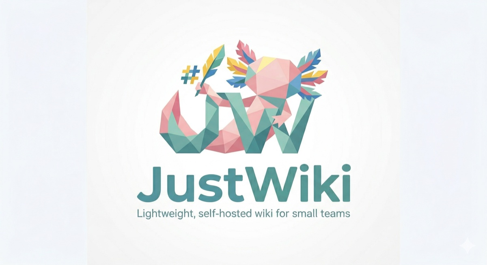
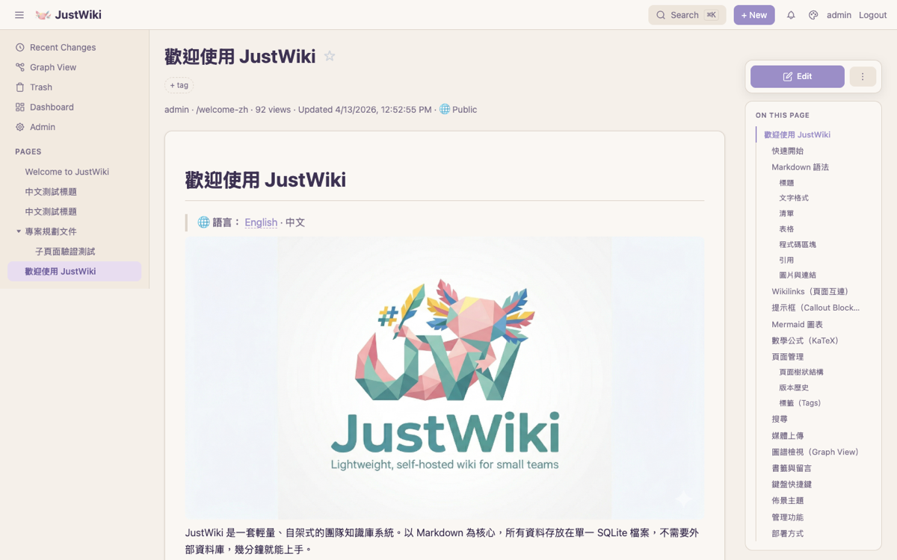
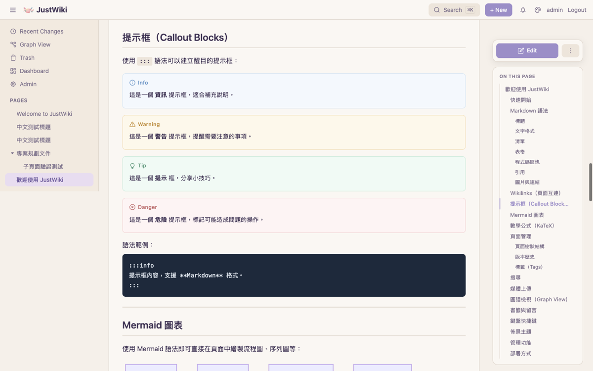
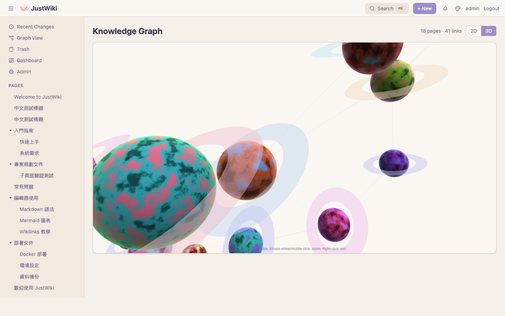
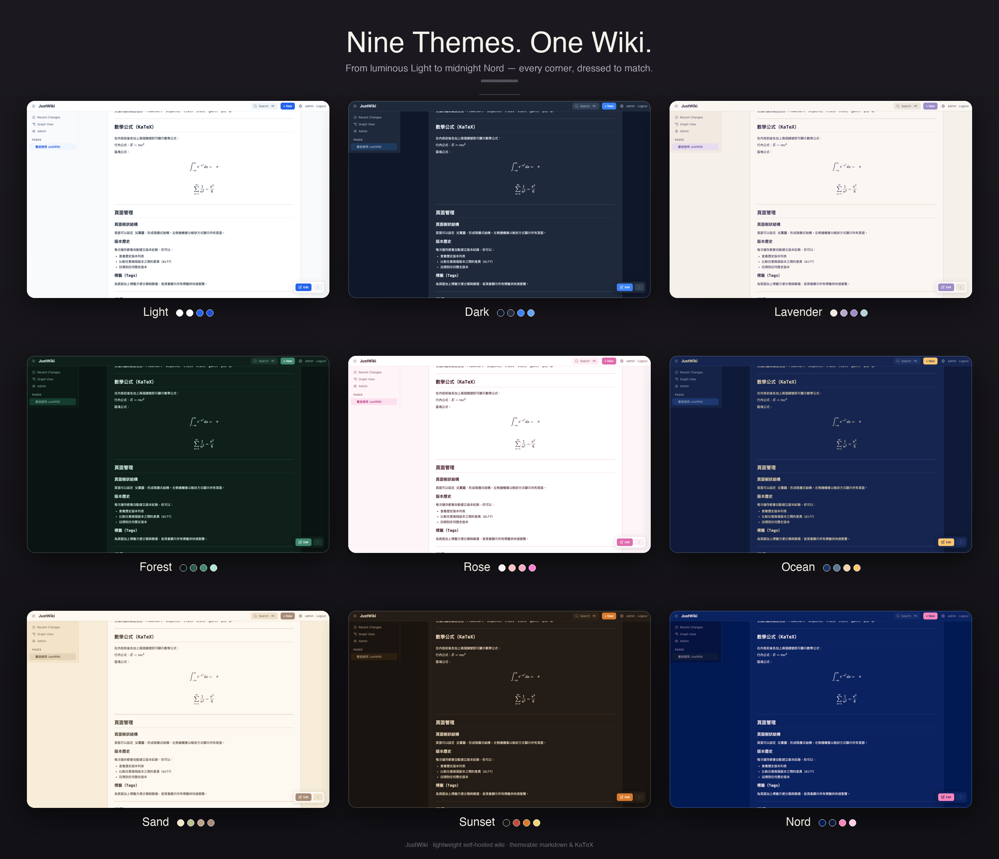
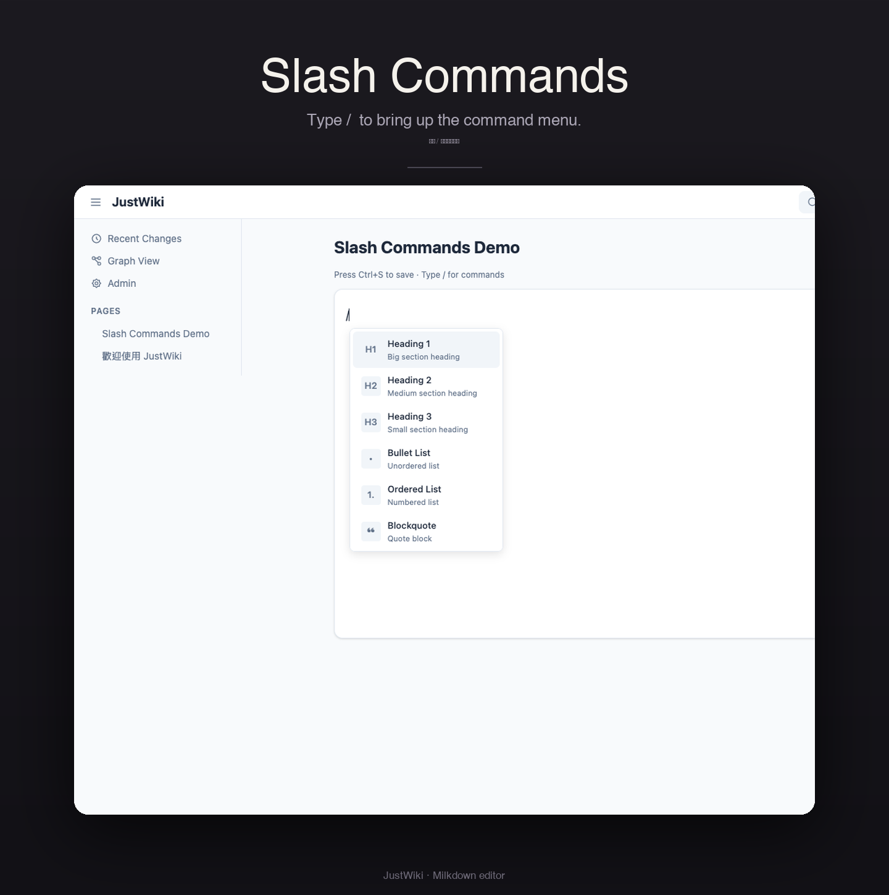
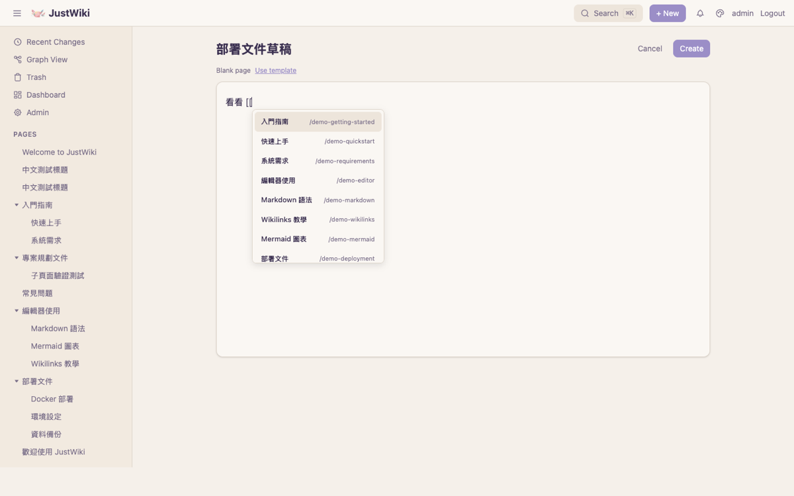

<p align="center">
  
</p>

<p align="center">
  <strong>English</strong> · <a href="README.md">中文</a>
</p>

# JustWiki

A lightweight, self-hosted wiki for small teams. Just clone, run, and write.

<p align="center">
  
</p>

## Why JustWiki

Built for "small team, no ops headaches":

- **vs Outline** — no PostgreSQL / Redis / MinIO, no 4 CPU / 8 GB box; a 1 vCPU / 512 MB VM — or even a Raspberry Pi — runs it fine
- **vs Wiki.js** — v3 has been "coming soon" since 2021 with no beta; v2 is in maintenance. JustWiki is actively developed
- **vs BookStack** — unlimited page nesting, not capped at Book → Chapter → Page
- **vs Notion / Obsidian** — self-hosted, your data on your own machine, with full multi-user collaboration (ACL, comments, page subscriptions) — not cloud lock-in or a single-user notebook

All your data = one `data/just-wiki.db` SQLite file + the `media/` folder. Backup, migration, and export are just copying files.

## Features

**Editing & content**
- **Markdown-first WYSIWYG** — Milkdown lets non-technical users write naturally, while the storage stays plain Markdown so engineers can pipe it through Git or scripts; you're never locked into a proprietary format
- **Slash commands & rich blocks** — Mermaid diagrams, KaTeX math, callout blocks
- **Wikilinks** — `[[page]]` syntax with automatic backlink tracking
- **Page hierarchy & templates** — nested page trees, one-click reusable templates
- **Draw.io integration** — embedded diagram editor

<p align="center">
  
</p>

**Views & search**
- **Multiple views** — tree and graph (with 3D / 2D-plane toggle)
- **Full-text search** — FTS5 powered, with native CJK support
- **Readable CJK URLs** — page URLs keep the original Chinese/Japanese/Korean title instead of mangling it into `%E4%B8...` escapes

<p align="center">
  
</p>

**AI Q&A (optional)**
- **Grounded in your wiki** — RAG retrieves the relevant pages and cites them as links at the bottom of each answer
- **Permission-aware** — respects ACL; the model only sees pages the current user can read
- **Bring your own model** — any OpenAI-compatible endpoint works (OpenAI, Gemini, Ollama, Groq, DeepSeek…)

<p align="center">
  
</p>

**Collaboration & permissions**
- **Multi-user + group ACL** — per-page permission control (inherited from parent pages)
- **Concurrent-edit safety** — optimistic locking (`base_version`) so simultaneous edits never silently clobber each other
- **Version history** — page revisions with diff view; roll back when something gets broken
- **Comments, bookmarks, tags, page subscriptions** — everything a small team needs
- **Activity log & trash** — see recent changes; deletions are soft and recoverable
- **SSO & API tokens** — built-in OIDC (Google, GitHub, custom), LDAP, and personal Bearer tokens for enterprise SSO and automation scripts

**Export & deployment**
- **Flexible export** — per-page Markdown / HTML / PDF (browser print), full-site static zip
- **One SQLite file** — no external database needed. Backup = copy one file
- **Themes** — 9 built-in color palettes ([preview](#themes))
- **Docker support** — `docker-compose up` and done

## Themes

<p align="center">
  
</p>

Nine curated palettes ship out of the box — **Light, Dark, Lavender, Forest, Rose, Ocean, Sand, Sunset, Nord**. Switch any time from the top-right theme picker; your choice is remembered per browser.

## Deployment

### Docker (Recommended)

The fastest way to get JustWiki running is with Docker Compose.

```bash
cp .env.example .env
# edit .env — at minimum change SECRET_KEY and ADMIN_PASS
docker-compose up -d
```

Open http://localhost:3000 to start writing.

### Configuration

All settings live in a single `.env` file. See [.env.example](.env.example) for available options.

Key variables:

| Variable        | Description                        | Default              |
| --------------- | ---------------------------------- | -------------------- |
| `SECRET_KEY`    | Session signing key                | `change-me-...`      |
| `ADMIN_USER`    | Admin username                     | `admin`              |
| `ADMIN_PASS`    | Admin password                     | `admin`              |
| `DB_PATH`       | SQLite database path               | `./backend/data/just-wiki.db`|
| `AI_ENABLED`    | Enable AI chat                     | `false`              |
| `AI_API_KEY`    | LLM provider API key (required if enabled) | —            |

## Usage

### Slash Commands

<p align="center">
  
</p>

In the editor, type `/` to open the slash menu. You can filter by typing after the slash.

| Command | Description |
| ------- | ----------- |
| `/h1` | Heading 1 — big section heading |
| `/h2` | Heading 2 — medium section heading |
| `/h3` | Heading 3 — small section heading |
| `/bullet` | Bullet List — unordered list |
| `/ordered` | Ordered List — numbered list |
| `/quote` | Blockquote — quote block |
| `/code` | Code Block — code snippet |
| `/hr` | Divider — horizontal rule |
| `/callout-info` | Info Callout — `:::info` block |
| `/callout-warning` | Warning Callout — `:::warning` block |
| `/callout-tip` | Tip Callout — `:::tip` block |
| `/callout-danger` | Danger Callout — `:::danger` block |
| `/mermaid` | Mermaid Diagram — insert mermaid chart |
| `/math` | Math Formula — KaTeX math block |
| `/drawio` | Draw.io Diagram — insert Draw.io embed |

### Wikilink Autocomplete

<p align="center">
  
</p>

Type `[[` in the editor to open a page search dropdown; keep typing to filter, ↑ ↓ to select, Enter to insert. JustWiki tracks the reverse direction automatically — every page shows incoming links in its **LINKED FROM** section.

---

## Development Guide

### Tech Stack

| Layer    | Stack                                          |
| -------- | ---------------------------------------------- |
| Backend  | Python, FastAPI, aiosqlite, Pydantic           |
| Frontend | React 19, Vite, Tailwind CSS 4, Zustand        |
| Editor   | Milkdown (ProseMirror)                         |
| Database | SQLite (single file)                           |
| Deploy   | Docker Compose                                 |

### Local Development

1. **Setup**: Install backend & frontend dependencies and create `.env`
   ```bash
   make setup
   ```
   *Requires: Python 3.11+, Node.js 20+, [uv](https://docs.astral.sh/uv/)*

2. **Run**: Start backend (port 8000) and frontend (port 3000)
   ```bash
   make dev
   ```

### Makefile Commands

| Command | Description |
| ------- | ----------- |
| `make dev` | Start backend + frontend in dev mode |
| `make dev-backend` | Start backend only |
| `make dev-frontend` | Start frontend only |
| `make build` | Build frontend for production |
| `make backup` | Backup SQLite database with timestamp |
| `make clean` | Remove database, media, and frontend dist |
| `make docker-up` | `docker-compose up -d` |
| `make docker-down` | `docker-compose down` |
| `make setup` | First-time setup (install deps, create .env) |

### Project Structure

```
justwiki/
├── backend/          # FastAPI REST API
│   └── app/
│       ├── main.py
│       ├── routers/  # pages, search, media, tags, versions, ...
│       └── services/ # markdown, search, AI, webhook, export
├── frontend/         # React SPA (Vite)
│   └── src/
│       ├── components/
│       │   ├── Editor/   # Milkdown editor
│       │   ├── Viewer/   # Markdown renderer
│       │   ├── Search/   # Search
│       │   └── Layout/   # Sidebar, Navbar
│       ├── pages/
│       ├── hooks/
│       └── store/        # Zustand
├── data/             # Runtime data (SQLite, media)
├── docker-compose.yml
├── Makefile
└── .env.example
```

## License

This project is licensed under the [MIT License](LICENSE).
